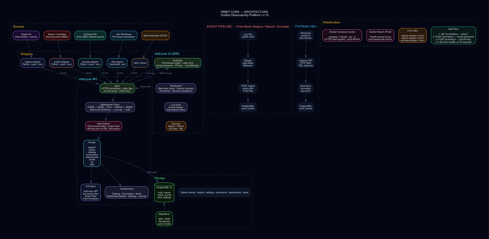

# orbit-core — Architecture (current)

Last updated: 2026-03-15

## 1) Overview

**orbit-core** is an API-first telemetry core backed by Postgres, with a canonical schema for:

- **Assets** (`assets`)
- **Timeseries metrics** (`metric_points`) + **rollups** (`metric_rollup_5m`, `metric_rollup_1h`)
- **Events** (`orbit_events`)
- **Dashboards** (`dashboards`)
- **Alert rules + channels** (`alert_rules`, `alert_channels`)
- **Connector specs** (`connectors`)
- **Threat indicators** (`threat_indicators`) — IoCs from MISP and other threat intel sources
- **Threat matches** (`threat_matches`) — correlations between events and IoCs

Deterministic connectors (Nagios, Wazuh, Fortigate via Wazuh, n8n, MISP, macOS) ship data to ingest endpoints.
Consumers query data via `POST /api/v1/query`.

An optional **AI agent** can assist with dashboard authoring by:
- querying the live catalog
- producing a strict `DashboardSpec`
- validating it server-side before persistence

The **AI Connector Generator** (`POST /api/v1/ai/plugin`) produces a connector spec, ingestion script and README from a plain-language description of any HTTP API.

## 2) Diagram



Diagram source: `docs/diagrams/orbit-core-architecture.dot`.

This diagram is intentionally **educational**:
- it separates **sources** from **connectors**
- it highlights the **edge boundary** (TLS/auth/subpath)
- it shows how everything converges on the same ingest API and Postgres schema

## 3) Components

### 3.1 Edge (reverse proxy)

Typical production setup (Traefik / Nginx):

- TLS termination
- **API key authentication** (`X-Api-Key`) enforced by the API container (recommended)
- optional BasicAuth at the edge (legacy / extra layer)
- subpath routing (e.g. `/orbit-core/`)
- redirect `/orbit-core` → `/orbit-core/` to avoid SPA relative-path bugs

### 3.2 API (Node 22 / Express)

Primary routes:

| Method | Route | Description |
|---|---|---|
| GET | `/api/v1/health` | Health + build info + DB status |
| GET | `/api/v1/system` | Live infra metrics: CPU, memory, disk, network I/O, DB pool, pg_stats (db size, cache hit %, active connections, reads/s, writes/s), worker health |
| GET | `/api/v1/metrics` | Internal metrics (JSON) |
| GET | `/api/v1/metrics/prom` | Internal metrics (Prometheus) |
| POST | `/api/v1/ingest/metrics` | Batch ingest metrics |
| POST | `/api/v1/ingest/events` | Batch ingest events |
| POST | `/api/v1/ingest/raw/:id` | Push raw payload to a registered connector |
| POST | `/api/v1/query` | OrbitQL queries |
| GET | `/api/v1/catalog/assets` | Assets catalog |
| GET | `/api/v1/catalog/metrics` | Metrics catalog by asset |
| GET | `/api/v1/catalog/dimensions` | Dimension values |
| GET | `/api/v1/catalog/events` | Events catalog |
| CRUD | `/api/v1/dashboards/*` | Dashboard persistence (JSONB) |
| POST | `/api/v1/dashboards/validate` | Validate DashboardSpec |
| POST | `/api/v1/ai/dashboard` | Anthropic proxy + DashboardSpec generation |
| POST | `/api/v1/ai/plugin` | AI Connector Generator: returns connector_spec + agent_script + readme |
| GET | `/api/v1/correlations` | Event correlations |
| CRUD | `/api/v1/alerts/rules` | Alert rules CRUD (threshold + absence) |
| CRUD | `/api/v1/alerts/channels` | Notification channels CRUD (webhook / Telegram) |
| GET | `/api/v1/alerts/history` | Notification log |
| CRUD | `/api/v1/connectors` | Connector specs CRUD |
| POST | `/api/v1/connectors/:id/approve` | Approve a connector spec |
| POST | `/api/v1/connectors/:id/test` | Dry-run test a connector |
| POST | `/otlp/v1/traces` | OTLP/HTTP traces receiver |
| POST | `/otlp/v1/metrics` | OTLP/HTTP metrics receiver |
| POST | `/otlp/v1/logs` | OTLP/HTTP logs receiver |

Authentication:
- recommended: `X-Api-Key` header (`ORBIT_API_KEY`)
- legacy: BasicAuth (edge-only / compatibility)

Payload limits:
- `express.json({ limit: '1mb' })` → keep connector batches bounded (events can be large)

### 3.3 UI (Vite + React)

The UI is fully **mobile-responsive** and ships with a language switcher supporting **EN / PT / ES**.

All query tabs (Metrics, Events, Nagios, Correlations) use the **TimeRangePicker** component: preset pills (1h, 6h, 24h, 7d, 30d), datetime-local inputs for custom ranges, and a "↻ agora" button to reset to the current time. This replaces the previous ISO text input fields.

Main tabs:

| Tab | Content |
|---|---|
| **Home** | KPIs, charts, EPS, consolidated live feed |
| **System** | Live infrastructure monitoring: CPU load, memory, disk usage, network I/O, PostgreSQL I/O & stats (db size, cache hit %, active connections, reads/s, writes/s), worker health pills |
| **Dashboards** | Builder (AI-assisted optional), saved dashboards, rotation/view mode |
| **Metrics** | Query builder for `timeseries` and `timeseries_multi` with TimeRangePicker |
| **Events** | Filtered events table with TimeRangePicker |
| **Correlations** | Automatically detected event correlations with TimeRangePicker |
| **Alerts** | Alert rules CRUD (threshold + absence), notification channels (webhook/Telegram), alert history, silence management |
| **Connectors** | Connector specs CRUD, AI Generator flow, dry-run test, plugin generator |
| **Sources** | Source cards and status |
| **Admin** | API key, AI agent config, operational info |

The API key is stored in `localStorage` and can be preconfigured at build time via:
- `VITE_ORBIT_API_KEY` (UI package `.env`)

### 3.4 Workers

Four background workers run continuously inside the API process:

| Worker | Responsibility |
|---|---|
| `rollup` | Computes 5m and 1h rollups; enforces retention on raw + rollup tables |
| `correlate` | Z-score anomaly detection; writes correlation records |
| `alerts` | Evaluates alert rules every 60s; dispatches webhook / Telegram notifications |
| `connectors` | Pulls data from approved connector specs every 5 min; posts to ingest endpoints |
| `threat-intel` | Scans recent events every 2 min; extracts IPs/domains/hashes and matches against active threat indicators; generates `ioc.hit` events |

### 3.5 Postgres

Canonical schema with automated rollups and retention:

| Table | Content | Retention |
|---|---|---:|
| `assets` | Asset catalog (name, type, tags) | — |
| `metric_points` | Raw metrics (value + JSONB dimensions) | 14 days |
| `metric_rollup_5m` | 5-minute rollup | 90 days |
| `metric_rollup_1h` | 1-hour rollup | 180 days |
| `orbit_events` | Normalized events | — |
| `orbit_correlations` | Correlation records | — |
| `dashboards` | Dashboard specs as JSONB | — |
| `alert_rules` | Threshold + absence alert rule definitions | — |
| `alert_channels` | Webhook / Telegram notification channel configs | — |
| `alert_history` | Notification dispatch log | — |
| `connectors` | Connector spec definitions | — |
| `threat_indicators` | IoC indicators (IPs, domains, hashes, URLs) from MISP | — |
| `threat_matches` | Event ↔ indicator correlation hits | — |

## 4) Data flow

### 4.1 Connectors → orbit-core

```
Nagios perfdata spool   → connectors/nagios/ship_metrics.py → POST /api/v1/ingest/metrics
Nagios HARD event spool → connectors/nagios/ship_events.py  → POST /api/v1/ingest/events
Wazuh alerts.json       → connectors/wazuh/ship_events.py   → POST /api/v1/ingest/events
n8n REST API polling    → connectors/n8n/ship_events.py     → POST /api/v1/ingest/events
Fortigate syslog → Wazuh → connectors/wazuh/ship_events.py  → POST /api/v1/ingest/events
macOS LaunchAgent       → AI-generated agent script          → POST /api/v1/ingest/raw/:source_id
                                                               (namespace: macos; metrics: cpu.usage_pct,
                                                                memory.*, disk.*)
MISP                    → connectors/misp/ship_misp.py        → POST /api/v1/threat-intel/indicators
                                                               + POST /api/v1/ingest/events (high/medium IoCs)
OTel SDK / agent        → POST /otlp/v1/{traces,metrics,logs}
Any HTTP API            → connectors worker (approved spec)  → POST /api/v1/ingest/metrics|events
```

All deterministic connectors are cron-friendly and track state using a local file:
- byte-offset cursors for local JSONL files
- ISO timestamp cursors for API polling

### 4.2 AI Connector Generator (end-to-end)

High-level flow:

1. User describes a source API in plain language (UI or direct API call)
2. `POST /api/v1/ai/plugin` sends the description to the AI model
3. API returns `connector_spec` + `agent_script` + `readme`
4. UI shows the result with a copy button and a "Use this Spec" button
5. "Use this Spec" pre-fills the Connectors CRUD form; user reviews and saves
6. `POST /api/v1/connectors/:id/approve` activates the connector
7. The `connectors` worker begins polling on the next cycle

### 4.3 AI dashboard builder (end-to-end)

High-level flow:

1. UI sends a prompt to `POST /api/v1/ai/dashboard`
2. API queries the live catalog (assets/metrics/event namespaces)
3. API builds a system prompt with contracts + catalog + playbooks
4. The model produces a `DashboardSpec`
5. API validates it server-side (Zod) and returns it to the UI

## 5) Query engine notes

### 5.1 `timeseries`

Single series with optional aggregation and downsampling.

### 5.2 `timeseries_multi`

Multiple series with optional:
- `group_by_dimension` (splits a series into multiple)
- Top-N limiting (`top_n`, `top_by`, `top_lookback_days`) to control cardinality

### 5.3 RAW vs rollup selection

The query engine selects the source table automatically based on the requested time range.
The response includes `meta.source_table`.

## 6) Operations

### 6.1 Rollups + retention

Rollups and retention are executed by the `rollup` background worker running inside the API process. The worker runs on a fixed schedule and handles both 5m and 1h aggregation as well as enforcement of per-table retention windows.

### 6.2 Production deploy (Docker Swarm + Traefik)

See `deploy.sh` and the stack files under `docker/` for the server reference deployment.

Key API container environment variables:
- `DATABASE_URL`
- `ORBIT_API_KEY`
- (optional) AI settings for `/api/v1/ai/dashboard` and `/api/v1/ai/plugin`

## 7) Connectors

See [`docs/connectors.md`](connectors.md) for the full overview and authoring standards.
